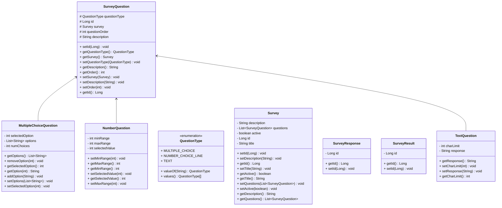

# SYSC4806-Team2

Public repository for the SYSC 4806 Project 2 team

## Milestone 1:

- Setup Github Actions
- Created the models for the survey questions (TextQuestion, MultipleChoiceQuestion, NumberLineQuestion)
- Created the controllers for creating the surveys
- Created the html page for creating surveys
- Wrote unit tests

### Milestone 2 (Expectations):

- Fix bugs from milestone 1
- Add questions to surveys
- Be able to customize individual questions (allow users to add or remove options)

## Milestone 2: Alpha Release

- Added functionality for creating 3 types of Survey questions
- Added functionality for adding Survey questions to a Survey
- Added Activate/Deactivate functionality to Surveys
- Added functionality to display Survey with all added questions
- Added response functionality when viewing an active Survey that has questions
- Unit testing for MultipleChoiceQuestion, NumberQuestion, TextQuestion, QuestionController, SurveyController

### Schemas:

### UML Diagram:

```mermaid
classDiagram
direction BT
class MiniSurveyMonkeyApplication {
  - Logger log
  + main(String[]) void
}
class MultipleChoiceQuestion {
  - int selectedOption
  - List~String~ options
  - int numChoices
  + getOptions() List~String~
  + removeOption(int) void
  + getSelectedOption() int
  + getOption(int) String
  + addOption(String) void
  + setOptions(List~String~) void
  + setSelectedOption(int) void
}
class NumberQuestion {
  - int minRange
  - int maxRange
  - int selectedValue
  + setMinRange(int) void
  + getMaxRange() int
  + getMinRange() int
  + setSelectedValue(int) void
  + getSelectedValue() int
  + setMaxRange(int) void
}
class QuestionController {
  - QuestionRepository questionRepository
  + selectQuestion(Model) String
  + createQuestion(Model) String
  + textQuestion(TextQuestion) String
  + saveNumberQuestion(NumberQuestion) String
  + saveMcQuestion(String, MultipleChoiceQuestion) String
}
class QuestionRepository {
<<Interface>>
  + findBySurvey(Survey) List~SurveyQuestion~
}
class QuestionType {
<<enumeration>>
  +  MULTIPLE_CHOICE
  +  NUMBER_CHOICE_LINE
  +  TEXT
  + valueOf(String) QuestionType
  + values() QuestionType[]
}
class Survey {
  - String description
  - List~SurveyQuestion~ questions
  - boolean active
  - Long id
  - String title
  + setId(Long) void
  + setDescription(String) void
  + getId() Long
  + setTitle(String) void
  + getActive() boolean
  + getTitle() String
  + setQuestions(List~SurveyQuestion~) void
  + setActive(boolean) void
  + getDescription() String
  + getQuestions() List~SurveyQuestion~
}
class SurveyController {
  - SurveyRepository surveyRepository
  - QuestionRepository questionRepository
  + createSurvey(Model) String
  + viewSurveys(Model) String
  + selectSurvey(Model) String
  + addQuestion(Long, Long, Model) String
  + selectQuestion(Model) String
  + deactivateSurvey(Long) String
  + saveSurvey(Survey) String
  + showSurvey(Long, Model) String
  + activateSurvey(Long) String
}
class SurveyQuestion {
  # QuestionType questionType
  # Long id
  # Survey survey
  # int questionOrder
  # String description
  + setId(Long) void
  + getQuestionType() QuestionType
  + getSurvey() Survey
  + setQuestionType(QuestionType) void
  + getDescription() String
  + getOrder() int
  + setSurvey(Survey) void
  + setDescription(String) void
  + setOrder(int) void
  + getId() Long
}
class SurveyRepository {
<<Interface>>

}
class SurveyResponse {
  - Long id
  + getId() Long
  + setId(Long) void
}
class SurveyResponseController {
  - SurveyResponseRepository surveyResponseRepository
  + createResponse(SurveyResponse) String
}
class SurveyResponseRepository {
<<Interface>>

}
class SurveyResult {
  - Long id
  + getId() Long
  + setId(Long) void
}
class TextQuestion {
  - int charLimit
  - String response
  + getResponse() String
  + setCharLimit(int) void
  + setResponse(String) void
  + getCharLimit() int
}

MultipleChoiceQuestion  -->  SurveyQuestion 
NumberQuestion  -->  SurveyQuestion 
TextQuestion  -->  SurveyQuestion 
```

### Milestone 3 Expectations:

- Clean up UI (Custom Thymeleaf template, NAV bar, Format for Home page)
- Fix bugs that cause duplicate Survey if user refreshes page when trying to add a question
- Determine final scope of project
- Analyze Survey results and produce graphs/plots based on Survey questions

## Milestone 3: Final Demo

- Added home button to pages
- Updated process of adding questions to surveys
- Updated styling of pages
- Added unit tests for Survey class
- Added CI badge

### Schemas:

### UML Diagram:

