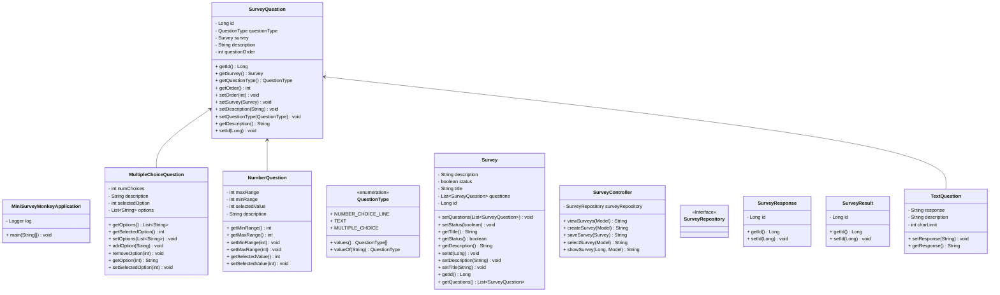

# SYSC4806-Team2
Public repository for the SYSC 4806 Project 2 team

```mermaid
classDiagram
direction BT
class MiniSurveyMonkeyApplication {
  - Logger log
  + main(String[]) void
}
class MultipleChoiceQuestion {
  - int numChoices
  - String description
  - int selectedOption
  - List~String~ options
  + getOptions() List~String~
  + getSelectedOption() int
  + setOptions(List~String~) void
  + addOption(String) void
  + removeOption(int) void
  + getOption(int) String
  + setSelectedOption(int) void
}
class NumberQuestion {
  - int maxRange
  - int minRange
  - int selectedValue
  - String description
  + getMinRange() int
  + getMaxRange() int
  + setMinRange(int) void
  + setMaxRange(int) void
  + getSelectedValue() int
  + setSelectedValue(int) void
}
class QuestionType {
<<enumeration>>
  +  NUMBER_CHOICE_LINE
  +  TEXT
  +  MULTIPLE_CHOICE
  + values() QuestionType[]
  + valueOf(String) QuestionType
}
class Survey {
  - String description
  - boolean status
  - String title
  - List~SurveyQuestion~ questions
  - Long id
  + setQuestions(List~SurveyQuestion~) void
  + setStatus(boolean) void
  + getTitle() String
  + getStatus() boolean
  + getDescription() String
  + setId(Long) void
  + setDescription(String) void
  + setTitle(String) void
  + getId() Long
  + getQuestions() List~SurveyQuestion~
}
class SurveyController {
  - SurveyRepository surveyRepository
  + viewSurveys(Model) String
  + createSurvey(Model) String
  + saveSurvey(Survey) String
  + selectSurvey(Model) String
  + showSurvey(Long, Model) String
}
class SurveyQuestion {
  - Long id
  - QuestionType questionType
  - Survey survey
  - String description
  - int questionOrder
  + getId() Long
  + getSurvey() Survey
  + getQuestionType() QuestionType
  + getOrder() int
  + setOrder(int) void
  + setSurvey(Survey) void
  + setDescription(String) void
  + setQuestionType(QuestionType) void
  + getDescription() String
  + setId(Long) void
}
class SurveyRepository {
<<Interface>>

}
class SurveyResponse {
  - Long id
  + getId() Long
  + setId(Long) void
}
class SurveyResult {
  - Long id
  + getId() Long
  + setId(Long) void
}
class TextQuestion {
  - String response
  - String description
  - int charLimit
  + setResponse(String) void
  + getResponse() String
}

MultipleChoiceQuestion  -->  SurveyQuestion 
NumberQuestion  -->  SurveyQuestion 
TextQuestion  -->  SurveyQuestion 
```